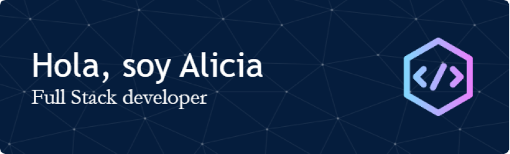

  

## Sobre mí ℹ

- 🎓 Desarrolladora Web Full Stack en Factoría F5,  aprendiendo siempre para convertirme en una desarrolladora profesional.
   
- 🚀 Disfruto colaborando con personas apasionadas, contribuyendo al éxito conjunto en cada proyecto.

- ⚡ Me encanta la historia de la Humanidad y la tecnología es una herramienta que puede ayudar a mejorar el mundo, y quiero ser parte de ese cambio.
- 👨‍💻 Mi portfolio está en aún en construcción.  
- 📫 Contáctame:
    aliciared7@gmail.com  

## <h2 align="left">🛠️STACK🛠️</h2>

                     

